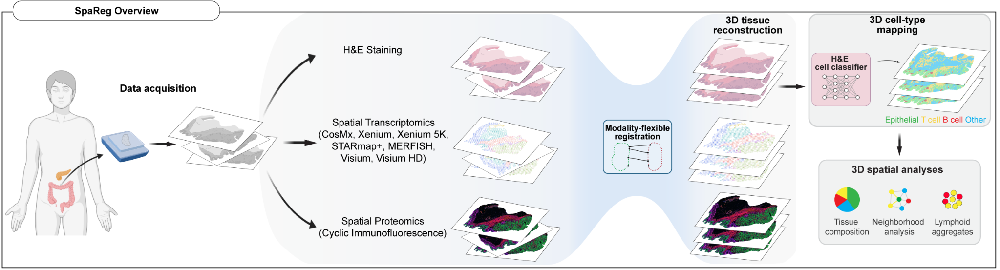
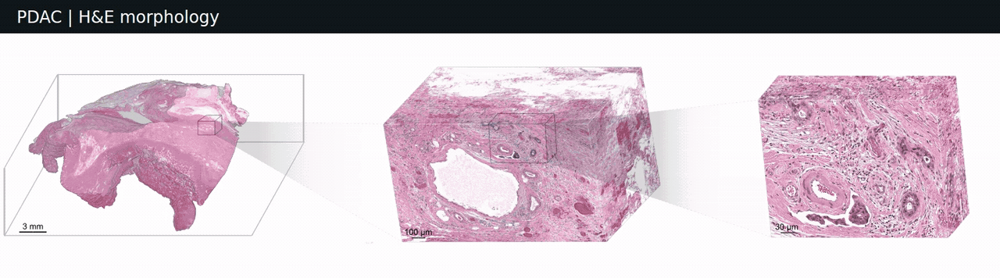
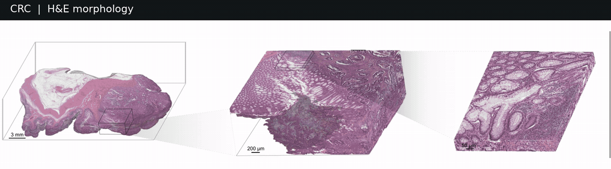
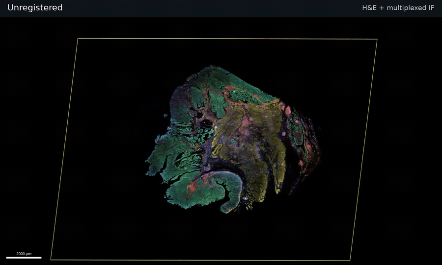
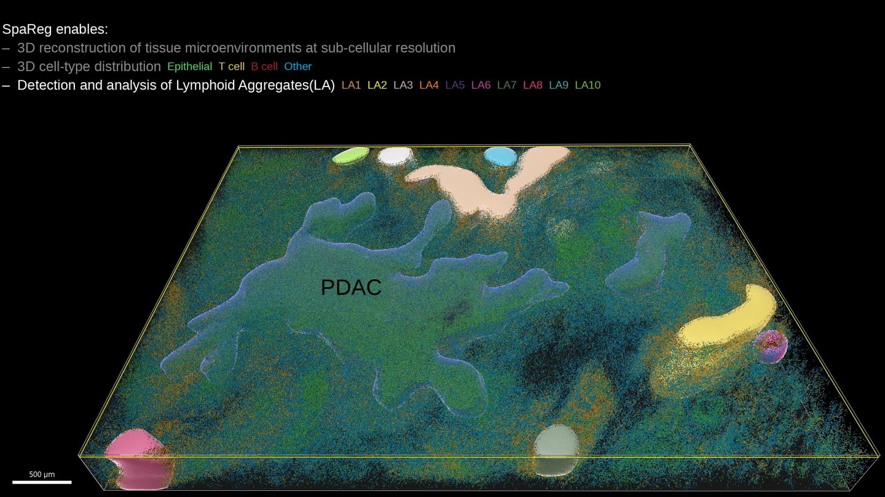
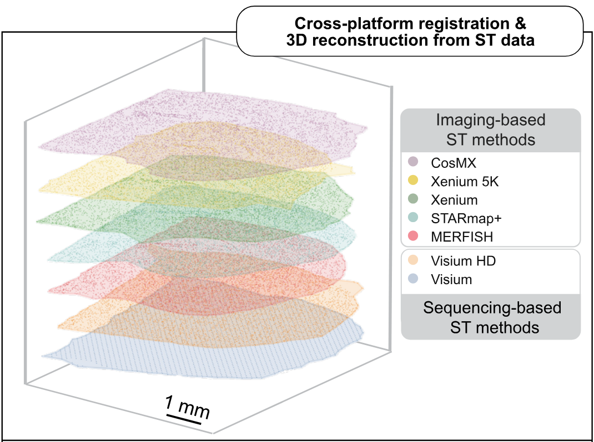

# SpaReg

### From serial sections to 3D tissue microenvironments

**Histology · Multiplexed immunofluorescence · Spatial transcriptomics**

SpaReg reconstructs tissue architecture and cellular organization in three dimensions from serial histology images and spatial molecular data, at the resolution needed to study cells in their tissue context.

## SpaReg at a glance

*From serial sections to tissue architecture, cell-type distributions, and spatial analyses.*

## From tissue architecture to cell distributions

### Pancreatic ductal adenocarcinoma

*Pancreatic tissue containing PDAC, reconstructed from 320 serial H&E sections.*

Cell types:  ·  ·  · .

### Colorectal cancer

*Colorectal tissue containing CRC, reconstructed from 307 serial H&E sections.*

## Integrating morphology and protein expression in 3D

*Integrating tissue architecture and cellular morphology with protein expression in 3D. The animation shows unregistered tissue, SpaReg registration, and views across serial sections, ending with a side-by-side comparison of unregistered and registered tissue. The reconstruction combines 21 H&E and 24 immunofluorescence sections from a Human Tumor Atlas Network colorectal cancer specimen.*

## SpaReg enables

- **Recover tissue architecture across depth.** Resolve glandular organization and tumor–stromal relationships across serial sections in benign and tumor tissue microenvironments.
- **Integrate morphology and molecular measurements.** Reconstruct interleaved H&E and multiplexed immunofluorescence sections, or align spatial transcriptomics spots and cells across sections and platforms.
- **Study cellular neighborhoods beyond a single plane.** Map H&E-predicted epithelial, T, and B cell distributions and characterize lymphoid aggregate continuity and tumor proximity.

## A biological view of the reconstruction

*From H&E morphology to predicted cell-type distributions and the 3D organization of lymphoid aggregates in pancreatic ductal adenocarcinoma (PDAC). [Watch the demonstration](assets/pdac-cell-organization.mp4).*

In the PDAC tissue analyzed in our study, individual 2D sections overestimated immune exclusion relative to the 3D reconstruction. Resolving tissue depth also revealed the continuity and tumor proximity of lymphoid aggregates. These analyses use H&E-predicted cell identities, with paired immunofluorescence used to train and evaluate the classifier.

*Cross-platform alignment of mouse-brain sections profiled using CosMx, Xenium 5K, Xenium, STARmap+, MERFISH, Visium HD, and Visium. Sections are colored by platform.*

## Availability and contact

Research preview, code coming soon. Follow the repository for release announcements.

**Authors:** Rajdeep Pawar, Thomas Jacob, Rebecca Raphael, Elaine Byrnes, Simon Watkins, T. Rinda Soong, Aatur Singhi, and Shikhar Uttam [shf28@pitt.edu](mailto:shf28@pitt.edu).

University of Pittsburgh · UPMC Hillman Cancer Center

<!-- Add a verified public preprint link and citation here when available. -->
